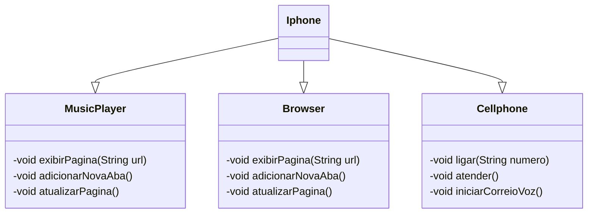

# Desafio POO DIO - Trilha Java Básico

Exercício de modelagem de Classe e Interfaces utilizando o lançamento do Iphone.

Diagrama UML:

```mermaid
classDiagram
    Iphone --|> MusicPlayer
    Iphone --|> Browser
    Iphone --|> Cellphone

    class Cellphone{
    -void ligar(String numero)
    -void atender()
    -void iniciarCorreioVoz()
    }
    class Browser{
        -void exibirPagina(String url)
        -void adicionarNovaAba()
        -void atualizarPagina()
    }
    class MusicPlayer{
    -void exibirPagina(String url)
    -void adicionarNovaAba()
    -void atualizarPagina()
    }
```